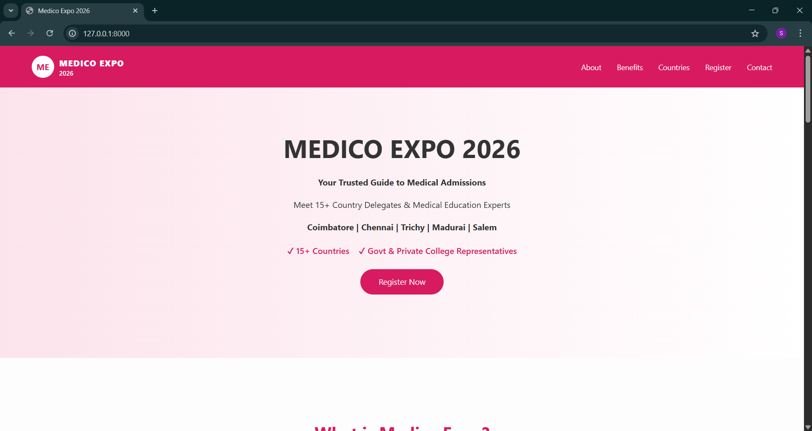

# Medical Admission Registration Landing Page

## 📌 Project Overview
This project is a professional landing page built using Django.
It allows students to register for medical admission counselling.

## 🚀 Tech Stack
- Frontend: HTML, CSS, JavaScript
- Backend: Django (Python)
- Database: SQLite

## ✨ Features
- Responsive landing page design
- Registration form with backend validation
- Custom mobile number validation (10 digits)
- Data stored in database
- Separate registrations view page

## 🔐 Validation
- Required field validation
- Custom backend validation for mobile number
- Server-side validation using Django ModelForm

## 📂 Project Structure
- models.py – Database model
- forms.py – Form and custom validation
- views.py – View logic
- templates/ – HTML files
- urls.py – Routing

## ▶ How to Run

1. Clone the repository
2. Install dependencies:

## 📸 Screenshot

